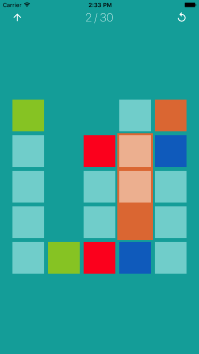
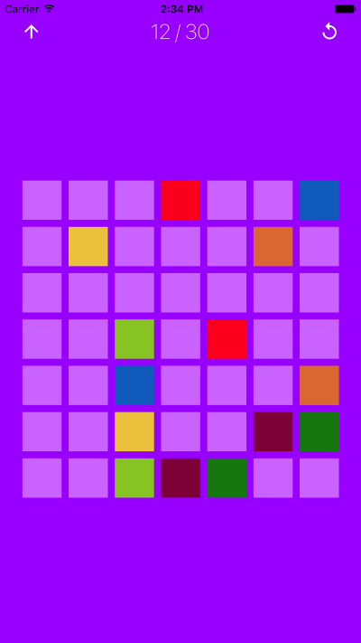

# BrainOffline - Cleared!
## Minimalist Puzzle Game - powered by Xamarin and Azure

The *Cleared!* project is my entry into the [Winter of Xamarin](https://www.microsoftevents.com/profile/web/index.cfm?PKWebId=0x503235b5d1) competition.

*Cleared!* is a Minimalistic Puzzle game where the idea is to clear the board by connecting the colored squared.

*Cleared!* is powered by Xamarin and Microsoft technology.
There is a shared component with all the game logic.
Each app is written using Xamarin Native, and leveraging the common game logic.
There are separate animation extensions to make the app pop out a bit.
There is a feedback component that allows the customer to send comments and how they feel about the app.  The powerhouse behind this is Azure.

Some of what I have learnt by working on the project is how quickly getting from idea to a working prototype, then to a cross-platform app, and finally published in the app stores.  [Xamarin](https://www.xamarin.com/) is truely an amazing product.

I have created a [YouTube video](https://youtu.be/3t7IEUB6LqA) of the app running.

And published the App to the [iOS App Store](https://itunes.apple.com/us/app/brainoffline-cleared/id1252321387?mt=8) as well and the [Google Play Store](https://play.google.com/store/apps/details?id=com.brainoffline.cleared).

The source has been release in [GitHub](https://github.com/brainoffline/Cleared) under the MIT license.

 
